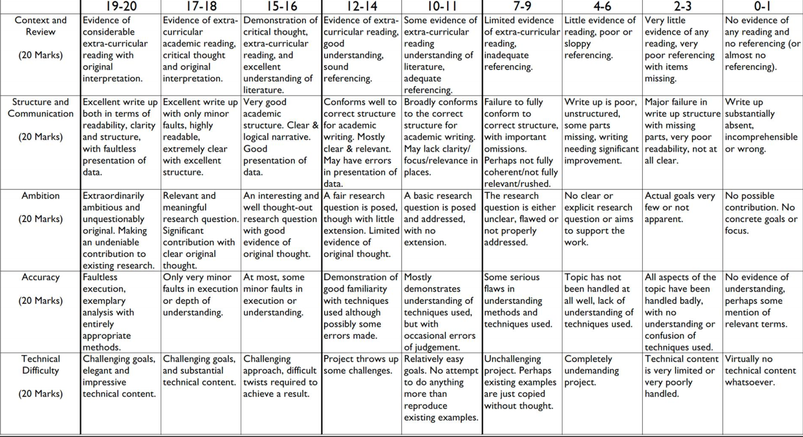
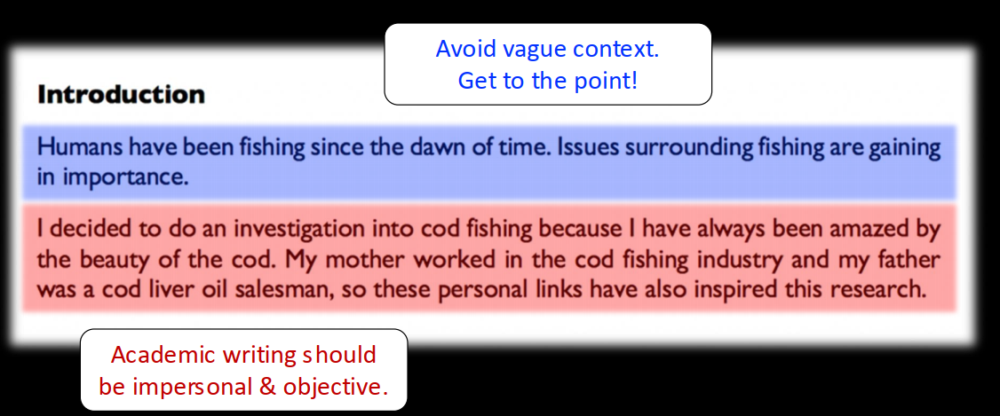
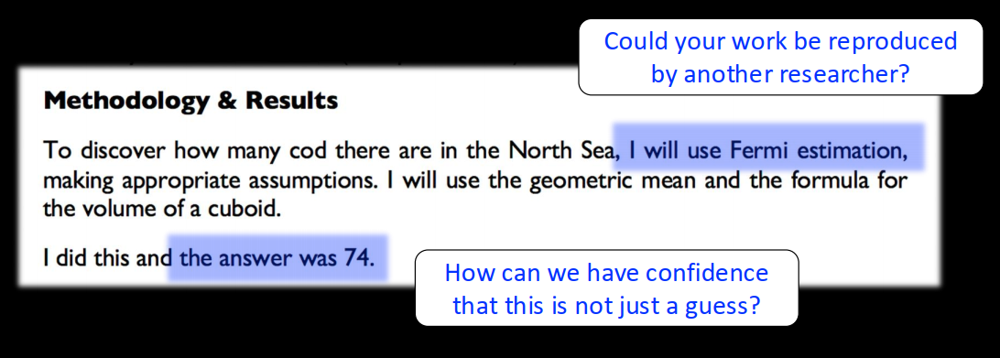
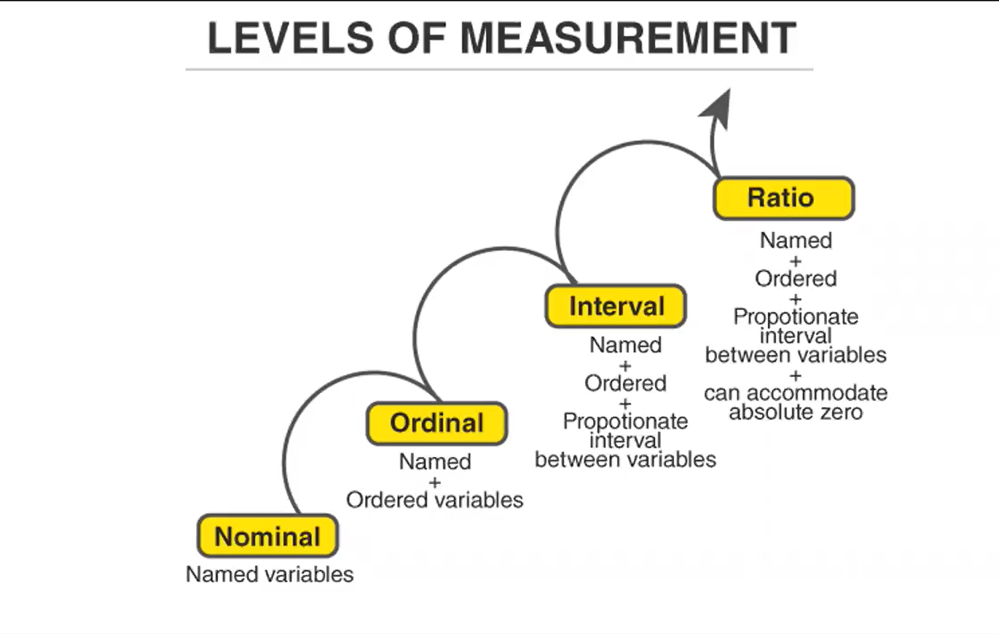
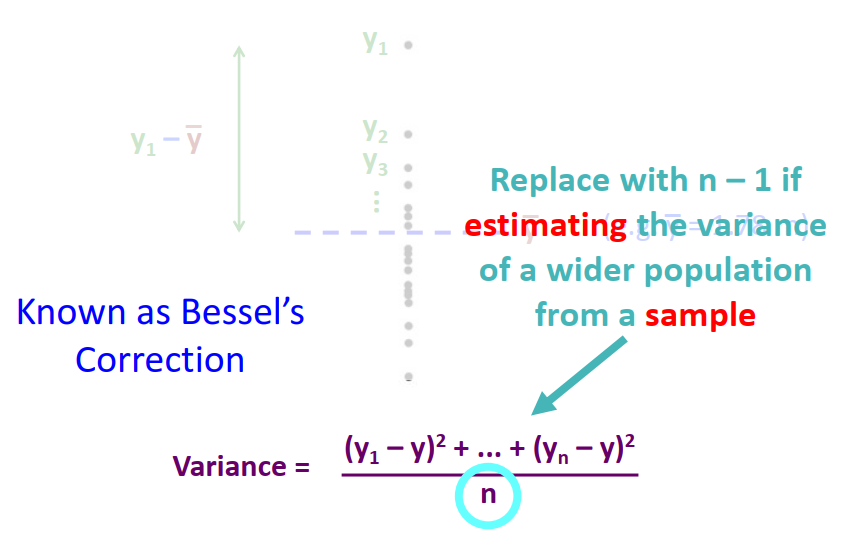
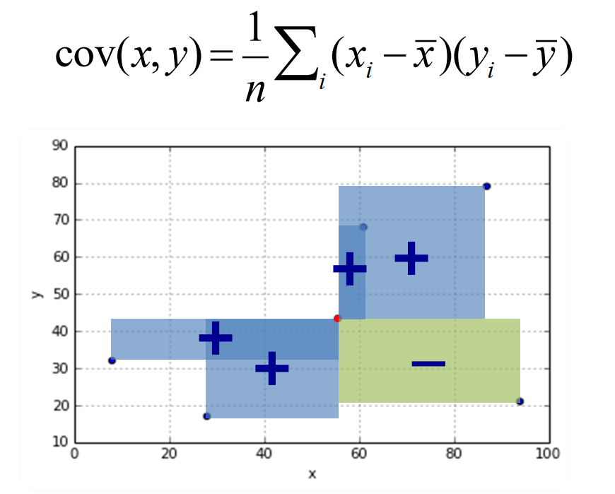
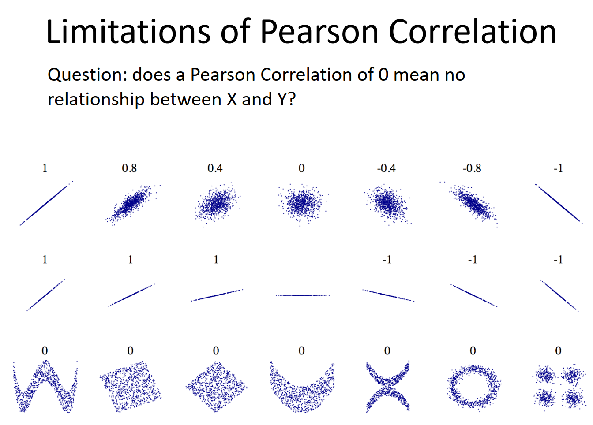
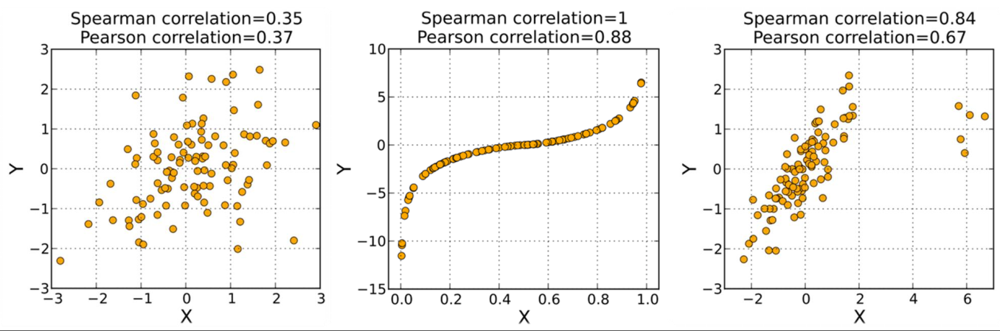
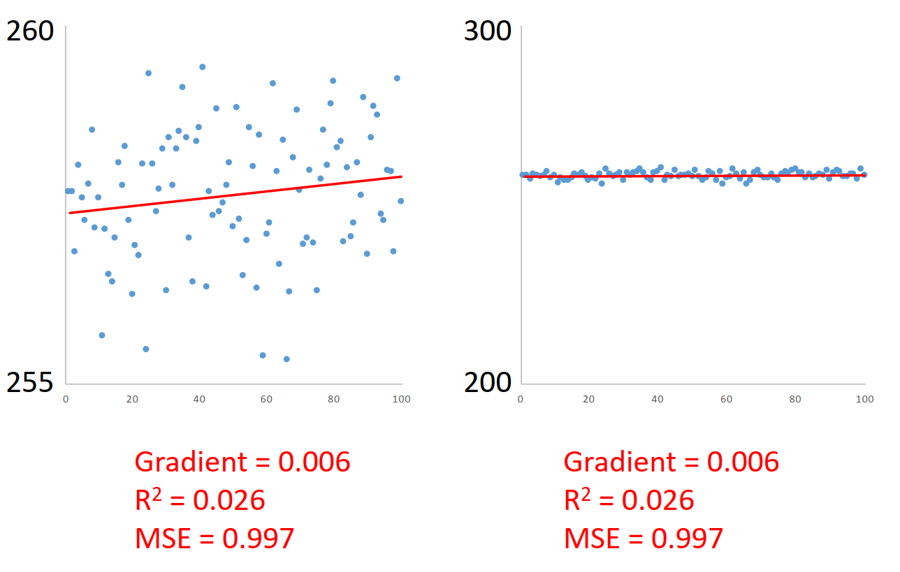

.. role:: raw-html-m2r(raw)
   :format: html

An Introduction to Quantitative Thinking
========================================

#. Understand the structure and focus of the module.
#. Consider the different roles of quantitative methods and their relevance in your work.
#. Develop a method for tackling quantitative problems.
#. Consider how to formulate a research question and structure a piece of quantitative writing  

Fermi Estimation Problems
-------------------------

A process for tackling questions
--------------------------------

#. State Assumptions.
#. Establish what you know (facts, formulae etc).
#. Establish what you don’t know, but need to know.
#. Sort out 3 by estimating, calculating or researching.
#. Put all back together to get an answer.
#. Think about whether your answer is sensible. Verify if possible.  

Good practice of a quantitative essay
-------------------------------------

Introduction
^^^^^^^^^^^^

* 
  Gives the reader a feel for your investigation.

* 
  Begins to justify your investigation

Literature Review
^^^^^^^^^^^^^^^^^

* 
  Sources for context vs. sources for methods

* 
  Is all the literature relevant to your investigation?

* 
  How has your reading informed your methodology?

* 
  Demonstrates the importance of your investigation

* 
  Takes a critical perspective 

* 
  (Engaging narrative)

* 
  don’t cite wikipedia

  .. image:: img/clip_image002.png
     :target: img/clip_image002.png
     :alt: clip_image002

Research question
^^^^^^^^^^^^^^^^^

* 
  explict

* 
  precise

  * real world relevance
  * informed by literature review
  * possibly split into sub-questions

Presentation of data
^^^^^^^^^^^^^^^^^^^^

* explains and visualisez your data for the reader

Methodology
^^^^^^^^^^^

* Precise

* Reproducible

* Explicitly informed by literature review

* Explicitly designed to answer research question

Results
^^^^^^^

* Clear

* Complete

* Minimal Text

* Presented in most informative way possible

Discussion
^^^^^^^^^^

* Highlights key points from results

* Interprets and synthesises

* Acknowledges limitations

* Relates back to research question

Conclusion
^^^^^^^^^^

* Explicitly answers research question (as far as possible)

* Proposes further research

.. image:: ./img/clip_image004.png
   :target: ./img/clip_image004.png
   :alt: 

Overall Style
^^^^^^^^^^^^^

* Impersonal

Use “we” or the passive (“A simulation was run.”)

Never use “I”

* Not narrative

Your Goal – Communicate your results

Not your goal – Describe your every thought and action in chronological order

* OBJECTIVES

* 1. Understand the structure and focus of the course.

* 2. Consider the different roles of quantitative methods and their relevance in your work.

* 3. Develop a method for tackling quantitative problems.

* 4. Consider how to formulate a research question and structure a piece of quantitative writing.

A Good Research Question…
-------------------------

* … cannot be answered with a single calculation ;
* … is not vague ; (it could be quite long to include detail /precision)
* … asks about the real world, not just about data or methods.
* … is interesting and valuable.
* … is ambitious.

Lecture 1 – Assignment
----------------------

Read one of the example QM Projects* provided on Moodle.

With reference to the mark scheme for written work,

consider what mark you would award to the project in the

streams ‘Context and Review’ and ‘Communication’.

Come to the next lecture prepared to talk about

your chosen mark and why you have awarded it.

(You may not understand the techniques used, but

do not worry about this. Focus on the structure and

the way that literature is used to support the work.)

Approaching & Communicating Data
================================

Objectives
----------

#. Understand basic data types 4中数据类型
#. Consider how to summarise and represent data. 数据描述方式
#. Understand basic distributions of data. 4种分布
#. Recognise three types of relationship between data series   三种关系

Assignment Discussion
---------------------

Data types
----------

Source : `Level of measurement <https://en.wikipedia.org/wiki/Level_of_measurement>`_

* 有序变量可用均值？间隔变量可用均值？
* 2020年是1010年的两倍 年在做标志和做度量的区别

Nominal data  名义变量
^^^^^^^^^^^^^^^^^^^^^^

* Differentiates items based only on names； No order；Also called categorical data
* Example: 

  * names, gender, country names
  * 土地利用分类数据

* Descriptive methods

  * Equality: ‘apple’ is not ‘pear’, ‘apple’ is ‘apple’ 
  * Mode (the most common item)  

Ordinal data  有序变量
^^^^^^^^^^^^^^^^^^^^^^

* Allow for rank order, but not the relative degree of difference
* Example

  * measurement of opinions
  * 高中低程度

* Descriptive methods

  * Equality Mode
  * The median: middle-ranked item
  * Differences do not make sense, nor do means.  

Interval data  间隔变量
^^^^^^^^^^^^^^^^^^^^^^^

* Allow for the degree of difference between items, but not the ratio between them. The zero value is arbitrary.  
* Example

  * temperature with the Celsius scale
  * 日期

* Descriptive methods

  * Equality, mode, median
  * Addition, Arithmetic mean
  * Ratio?   The coordinate of 8 is twice as far as that of 4  :no_entry_sign: 不能说20度是10度的两倍热

Ratio data 比率变量
^^^^^^^^^^^^^^^^^^^

* Allow for ratio between items; The zero value is unique and non-arbitrary.  
* Example

  * mass, length, energy  

* Descriptive methods

  * Equality, mode, median, arithmetic mean
  * Ratio 

Descriptive statistics
----------------------

Mean median and mode
^^^^^^^^^^^^^^^^^^^^

https://statisticsbyjim.com/basics/measures-central-tendency-mean-median-mode/

* Outliers and skewed data have a smaller effect on the median
* **When to use the median**\ : `Skewed <https://statisticsbyjim.com/glossary/skewed-data/>`_ distribution, Continuous data, `Ordinal data <https://statisticsbyjim.com/glossary/ordinal-variables/>`_
* **When to use the mode**\ : `Categorical data <https://statisticsbyjim.com/glossary/categorical-variables/>`_\ , Ordinal data, Count data, Probability Distributions
* 对于正态分布，三者无差异；偏态分布，中位数较好；有序数据，中位数或者众数较好；众数可以通过密度分布计算

About DP and SF
^^^^^^^^^^^^^^^

• DP: decimal places
• SF: significant figures  

Variance and std: Quantifying Spread
^^^^^^^^^^^^^^^^^^^^^^^^^^^^^^^^^^^^

Sample and Population
~~~~~~~~~~~~~~~~~~~~~

https://online.stat.psu.edu/stat200/book/export/html/21

.. image:: https://online.stat.psu.edu/stat200/sites/stat200/files/inline-images/InferenceGraphicSU17.png
   :target: https://online.stat.psu.edu/stat200/sites/stat200/files/inline-images/InferenceGraphicSU17.png
   :alt: 

Bessel's Correction
~~~~~~~~~~~~~~~~~~~

* 样本： n-1 
* 全集： n

Visualizing data
----------------

Outliers
^^^^^^^^

* Tukey Fences

$$
IQR = UQ-LQ \
LQ - 1.5\times IQR,UQ+1.5\times IQR
$$

* 
  ### Boxplot 

.. code-block:: python

   # This program creates a boxplot from data stored in a csv file and saves it as a png image.

   # The data file must be one column of numbers - no column labels, etc.
   # It must be saved as a csv file (e.g. use "Save As" in Excel and choose csv format).
   # It must be saved in the same folder as this program.
   # See the file sample_boxplot_data.csv for reference.

   # In the next line, replace sample_boxplot_data.csv with the filename of your data:
   data_filename = 'sample_boxplot_data.csv'

   # In the next line, replace boxplot with the filename you wish to save as:
   output_filename = 'boxplot.png'

   # Use the next line to set figure height and width (experiment to check the scale):
   figure_width, figure_height = 4,10

   # You can ignore these two lines:
   import matplotlib.pyplot as plt
   import numpy as np

   data = np.genfromtxt(data_filename)

   # If there are errors importing the data, you can also copy the data in as a list.
   # e.g. data = [1.95878982, 2.59203983, 1.22704688, ...]

   # This line creates the figure. 
   plt.figure(figsize=(figure_width,figure_height))

   # Uncomment the next three lines to set the axis limits (otherwise they will be set automatically):
   #axis_min = 0.95
   #axis_max = 4.05
   #plt.ylim([axis_min,axis_max])

   # The next lines create and save the plot:
   plt.xlim([0.75,1.25])
   plt.xticks([])
   plt.boxplot(data, manage_ticks=(False))
   plt.savefig(output_filename)

Distributions
-------------

* mean,median,mode 和 boxplot 是对于数据的通用方法，简单方法
* 另一种描述数据的方法-- probability distribution  Probability density function
* 概率分布与直方图的区别？

  * 如果要描述样本，则使用经验分布（即直方图），如果要描述假设的基础分布，则使用pdf。
  * 概率质量函数（pmf）针对的是离散变量，例如泊松分布。
  * 大学课程  https://ocw.tudelft.nl/courses/observation-theory-estimating-unknown/

* 如何判断是否分布

  * 图形验证

    * 直方图 
    * pdf
    * 经验累积概率图 : 也能拟合其他分布
    * 变换坐标轴的经验累积概率图
    * P-P图和Q-Q图

  * 统计检验

    * Kolmogorov-Smirnov检验
    * Anderson-Darling检验
    * Shapiro-Wilk检验

* https://docs.scipy.org/doc/scipy/reference/stats.html  

Normal Distribution
^^^^^^^^^^^^^^^^^^^

Log-normal
^^^^^^^^^^

* 不可小于0 一些值非常大

.. image:: https://upload.wikimedia.org/wikipedia/commons/thumb/a/ae/PDF-log_normal_distributions.svg/600px-PDF-log_normal_distributions.svg.png
   :target: https://upload.wikimedia.org/wikipedia/commons/thumb/a/ae/PDF-log_normal_distributions.svg/600px-PDF-log_normal_distributions.svg.png
   :alt: 

Poisson
^^^^^^^

* Poisson Distribution gives the probability of k events.  
* how many times things happen?
* 
  .. image:: https://upload.wikimedia.org/wikipedia/commons/thumb/1/16/Poisson_pmf.svg/650px-Poisson_pmf.svg.png
     :target: https://upload.wikimedia.org/wikipedia/commons/thumb/1/16/Poisson_pmf.svg/650px-Poisson_pmf.svg.png
     :alt: 

Exponential distribution
^^^^^^^^^^^^^^^^^^^^^^^^

* The Exponential distribution is linked to the Poisson distribution.
* If the Poisson measures the probability of x events within a time period, then the Exponential measures how long we are likely to wait between events.  
* So imagine an emergency room in a hospital. The exponential distribution will tell us how likely we are to wait x amount of time from one patient arriving to the next.  

:raw-html-m2r:`<u>Guessing Distribution</u>`
------------------------------------------------

#. Shoe size   normal 
#. The thickness of tree bark   lognormal 
#. The number of times a website is accessed per minute.  poisson
#. The time between phone calls at a call centre.   exponential 
#. The number of popcorn kernels popping in a 5 second window   **normal**  ？？ poisson 

   * 这是个时间序列而不是单位时间发生的次数

https://www.youtube.com/watch?v=YmOsDTczOFs&ab_channel=MindYourDecisions

Boxcox transform方法
^^^^^^^^^^^^^^^^^^^^

* 只是一种将数据转换为正态分布的方法
* 改变了数据的意义

Relationships
-------------

* 三种关系
* 如何判断关系

  * using logarithms to straighten curves
  * If your data makes a straight line on a log-linear plot, it may be an exponential relationship  
  * If your data makes a straight line on a log-log plot, it may be an power law relationship  
  * 如果数据在y对数图上是一条直线，那么它可能是指数关系
  * 双对数图上-- 幂律

* zipf's law 

Linear
^^^^^^

Bus stops in a line road and in a spatial circle 

Kleiber’s Law  and power law
^^^^^^^^^^^^^^^^^^^^^^^^^^^^

$$
Metabolic\ rate = M \times x^{n} \
x: body mass\
n: power
$$
Power law 

* for Cities
* Linear relationships are power laws!  
* 对于幂律，这种关系可能只适用于超过一定大小的值。考虑忽略小的价值
* 对于时间数据(例如年份)，可能没有自然的“零”。考虑从一个合理的基准时间度量。(例如，如果数据始于1900年，使用“自1900年以来的年份”)
* kleiber's la都是power law 的特殊
* zipf's law

Exponentials
^^^^^^^^^^^^

..

   “ The greatest shortcoming of the human race is our inability to understand the exponential function

   ​                                                                                                                         -- Albert Bartlett  

----

:raw-html-m2r:`<u>Suggested Reading/Viewing</u>`
----------------------------------------------------

* [ ] lectures
* [ ] `Padlet for disscussion qm projects <https://padlet.com/hannahfry/bbua7lcjtkyq6mh4>`_
* [ ] `Logarithms from Khan Academy <https://www.khanacademy.org/math/algebra2-2018/exponential-and-logarithmic-functions/introduction-to-logarithms/v/logarithms>`_
* [ ] Assignments

----

Basic Mathematical Catch-Up

* [ ] Introduction to logarithms: http://www.purplemath.com/modules/logs.htm
* [ ] A straightforward discussion of variance and standard deviation:  averages, their advantages and disadvantages: `http <http://www.abs.gov.au/websitedbs/a3121120.nsf/home/statistical+language+-+measures+of+central+tendency>`_\ `://www.abs.gov.au/websitedbs/a3121120.nsf/home/statistical+language+-+ <http://www.abs.gov.au/websitedbs/a3121120.nsf/home/statistical+language+-+measures+of+central+tendency>`_\ `measures+of+central+tendency <http://www.abs.gov.au/websitedbs/a3121120.nsf/home/statistical+language+-+measures+of+central+tendency>`_
* [ ] Box plots: http://www.physics.csbsju.edu/stats/box2.html

Variance - Deeper Thinking

* [ ] For those who know a bit of stats and have read that the sample variance should use n-1 as a divisor: http://www.crataegus.me.uk/thoughts/bessel_correction.html

Excel Tutorial

* [ ] For those not comfortable with Excel, here is a short entry-level tutorial on using Excel formulae: http://www.excel-easy.com/introduction/formulas-functions.html
* [ ] That site has loads more Excel advice, so have a look around there if you like.

Power Laws

* [ ] A TED talk on power laws for cities, given by one of the authors of the paper that I referred to in the lecture. Entertaining, relevant and informative and only 17 minutes long: https://www.ted.com/talks/geoffrey_west_the_surprising_math_of_cities_and_corporations#t-173864
* [ ] Here is a nice tutorial on power laws and log-log plots from the University of Plymouth. It goes into a little more detail than we did, so it is good for people who had trouble following (skip the bits that don't relate to what was covered in the lecture) or who are confident and want to extend/test their knowledge.\ `http://www.reading.ac.uk/AcaDepts/sp/PPLATO/imp/interactive%20mathematics/loglog2.pdf <http://www.reading.ac.uk/AcaDepts/sp/PPLATO/imp/interactive mathematics/loglog2.pdf>`_
* [ ] Here is an academic paper on power laws in cities. It is well worth a read for background knowledge, but do not worry if you do not understand all of it (skip the mathematical section: "Urban Growth Equation" on p7304, unless you are a mathematician or a masochist). http://www.pnas.org/content/104/17/7301.full.pdf
* [ ] There is also an accessible summary of the paper here:http://scienceblogs.com/purepedantry/2007/10/18/power-laws-and-cities/
* [ ] But note that there is a mistake in that summary. When they talk about "exponential" increases, they mean "superlinear". The academic paper does not discuss any exponential relationships.

----

Distributions

**Light Accessible Reading/Viewing**

Zipf’s Law:

-    https://plus.maths.org/content/mystery-zipf

-    http://io9.com/the-mysterious-law-that-governs-the-size-of-your-city-1479244159

Video: https://youtu.be/fCn8zs912OE?t=4

**Tutorials** 

Poisson Distribution (Good accessible overview): https://www.umass.edu/wsp/resources/poisson/

Stat Trek on Distributions: http://stattrek.com/probability-distributions/probability-distribution.aspx?Tutorial=Stat

Normal Distribution (In significant depth): http://onlinestatbook.com/2/normal_distribution/intro.html

**More Technical Background**

Lognormal across the sciences:\ ` http://stat.ethz.ch/~stahel/lognormal/bioscience.pdf <http://stat.ethz.ch/~stahel/lognormal/bioscience.pdf>`_

Working with Power Laws:

- `http://www-personal.umich.edu/~mejn/courses/2006/cmplxsys899/powerlaws.pd <http://www-personal.umich.edu/~mejn/courses/2006/cmplxsys899/powerlaws.pdf>`_

- https://arxiv.org/pdf/0706.1062.pdf

**Further Academic Papers**

There is More than a Power Law in Zipf: http://www.nature.com/articles/srep00812

----

 Albert Bartlett's lecture:https://youtu.be/O133ppiVnWY

BBC article on population projections: http://news.bbc.co.uk/1/hi/8000402.stm

Telegraph article on oil: http://www.telegraph.co.uk/news/earth/energy/oil/9867659/Why-the-world-isnt-running-out-of-oil.html

Assignment
----------

#. 
   Watch Albert Bartlett’s lecture on the exponential function: http://www.youtube.com/watch?v=F-QA2rkpBSY  (You only need to watch the first 20 minutes or so.)

   Read the following articles:  http://news.bbc.co.uk/1/hi/magazine/8000402.stm
   http://www.telegraph.co.uk/news/earth/energy/oil/9867659/Why-the-world-isnt-running-out-of-oil.html

   Consider what we should conclude about quantitative predictions?

#. 
   Have a play with the excel data investigation. It will guide you through how to plot and explore data in Excel. 

#. Look at the relationships data sets on moodle.  What do they reveal about the underlying relationships? 

Measuring Relationships
=======================

Objectives
----------

\1. Understand the concept of covariance, correlation and what it says about data relationships.
\2. Be able to measure a data relationship using simple linear regression.
\3. Learn how regression can be extended for data with more than two dimensions.
\4. Understand how to identify whether additional data provides additional information.  

Lectures
^^^^^^^^

How many ways do we have to measure correlation? What are the main differences between these measurements? What is partial correlation and how can we understand it intuitively?

We can't use correlation to predict, as correlation does not imply causation, but if variables are dependent then they are either causal to each other (in either direction) or driven by a common driver.

Do we need to perform a heteroskedasticity test before regression, and how can we do this?

* data type
* distribution
* relationship
* regression

Motivations for data transformation
-----------------------------------

#. 
   To formulate a different question  

#. 
   To meet the assumptions of a statistical inference procedure  

#. 
   To make data easier to visualise  

Outliers and Dealing with it
----------------------------

* 
  先用方法识别outliers ，根据经验判断是否保留

* 
  types of outliers 

  #. 
     Error

  #. 
     Points not following the pattern  

     * If you are studying the overall pattern, they need to be removed
       – e.g. City of London (in London)
       – e.g. Vantican City (1000 pop, gender ratio 7:1)
     * “Statistical oddities”

  #. 
     Points that are essential to the overall pattern

     * 
       Don’t remove them 

       e.g. New York in UＳ pop data  

* 
  There are many approaches to identify outliers (e.g. Tukey fences), but determining an outlier is a subjective exercise.

* 
  Dealing with outliers (not sure type 2 or 3)  

  * Retention, **but the application should use methods that are robust to outlier points**
  * Exclusion. If some outliers are excluded, the reasons should be clearly stated on the report.  

----

Part 1. Covariance, Correlation, and Association
------------------------------------------------

Variability
^^^^^^^^^^^

a single variable
~~~~~~~~~~~~~~~~~

.. list-table::
   :header-rows: 1

   * - Data type
     - Metric
     - Visualisation
   * - ratio/interval (continuous/discrete)
     - Variance, standard deviation, etc.
     - Boxplot Histogram
   * - nominal
     - None
     - Bar chart
   * - ordinal
     - None
     - Bar chart

Co-variability of two variables
~~~~~~~~~~~~~~~~~~~~~~~~~~~~~~~

.. list-table::
   :header-rows: 1

   * - 
     - Ratio
     - Nominal/ordinal
   * - Ratio
     - Covariance, correlation
     - ---
   * - Nominal/ordinal
     - Analysis of Variance (ANOVA)
     - Confusion matrix

ANOVA (not covered here)
~~~~~~~~~~~~~~~~~~~~~~~~

• Whether two or more population means are equal
• When there are only two populations, it is called two sample t-test (covered in Lecture 5)
• E.g. is the mortality rate of Covid-19 the same across different cities?  

Covariance
~~~~~~~~~~

“Do the two variables change in the same direction?”
“To what extent do they change together?”  

* Meaning 
* Meaning of sign
* Range 
* Normalised 
* Symmetric

Correlation
^^^^^^^^^^^

Person Correlation
~~~~~~~~~~~~~~~~~~

$$
cor(X,Y) = r(X,Y) = \frac{cov(X,Y)}{std(X)\times std(Y)}
$$

**limitations**

* The Pearson correlation coefficient measures only **linear association**\ : how nearly the data fall on a
  straight line.
* It is not a good summary of association if the scatterplot has a nonlinear (curved) pattern.
* When you present the correlation, remember to present a scatterplot.  
* The Pearson correlation coefficient is appropriate only for interval or ratio variables, not nominal or
  ordinal variables – even if their values are numerical.
* Note the difference between the data type of the variable and the value.  

Spearman’s Rank Correlation Coefficient
~~~~~~~~~~~~~~~~~~~~~~~~~~~~~~~~~~~~~~~

$$
r\ *{s}=\rho*\ {\mathrm{rg}\ *{X}, \mathrm{rg}*\ {Y}}=\frac{\operatorname{cov}\left(\mathrm{rg}\ *{X}, \mathrm{rg}*\ {Y}\right)}{\sigma\ *{\mathrm{rg}*\ {X}} \sigma\ *{\mathrm{rg}*\ {Y}}}
$$

* It is applicable for interval/ratio data

  * Transform the value into ranks;
  * Calculate the Rank correlation.

* But it is different from Pearson’s correlation, and they are incomparable.
* Less sensitive to outliers than Pearson correlation  

Limitations
~~~~~~~~~~~

* Pearson correlation is not applicable for nominal/ordinal data.
* It measures only linear association, and is not a good summary for non-linear data.
* It is a measure of association, not causation.
* It is not robust to outliers, less robust than Spearman’s rank correlation.  

correlation is a global metric, it doesn't give the local relation.

----

Part 2. Linear Regression
-------------------------

#. Where to place the line?
#. How well does the line represent the data?  

Necessary Conditions
~~~~~~~~~~~~~~~~~~~~

* Linear relationship exists
* Independent errors
* Normally distributed errors
* Equal error variance for all x values  

NOT a Necessary Condition!  : Normally Distributed Data  

2.1 Linear regression exists
^^^^^^^^^^^^^^^^^^^^^^^^^^^^

The relationship between y and x is linear; that is,  there is an equation, y=mx+c+ε that constitutes the population model.  

2.2Independent errors
^^^^^^^^^^^^^^^^^^^^^

* The residuals are independent; the value of one error is not affected by the value of another error.
* 
  In probability, two events A and B are independent if knowing that B happens does not alter the probability that
  A happens. E.g., flipping two coins. 

* 
  A and B are indepdent if Pr[B]=0 or Pr[A|B] = Pr[A]

* But… how can we know that?   

2.3 Normally distributed errors
^^^^^^^^^^^^^^^^^^^^^^^^^^^^^^^

* For each value of x, the errors have a normal distribution about the regression line. This normal distribution is centred on the regression line.
* It may be written as ε~𝑁(0, σ2)  

2.4 Equal error variance for all x values
^^^^^^^^^^^^^^^^^^^^^^^^^^^^^^^^^^^^^^^^^

* The errors about the regression line do not vary with x; that is, V[ε|x] = σ2  

residual plot

Part 3. Multiple Regression
---------------------------

#. Can we combine greenery and natural light to create a model for predicting wellbeing?
#. How does the combined model compare with individual models?
#. Can we put categorical variables into the model?  

Question 1
~~~~~~~~~~

With R2 values of 30-40%, both models leave a lot of variation unaccounted for.
Could we do better, by using BOTH data series to explain the variation in the reported well-being?  

Readings
--------

Tools and Techniques
^^^^^^^^^^^^^^^^^^^^

**Covariance and Correlation:** http://ci.columbia.edu/ci/premba_test/c0331/s7/s7_5.html

**Spearman's Rank Correlation Coefficient:** https://statistics.laerd.com/statistical-guides/spearmans-rank-order-correlation-statistical-guide.php

*As an aside, while there are lots of Spearman's Rank information resources online, it is difficult to find one that does not make misleading claims about (surprise, surprise) normality assumptions. Many resources claim that you would use Spearman rather than Pearson correlation if you think your data series are not normally distributed. This is false. Pearson correlation does not require normally distributed data (though some associated statistical tests do). The following two resources, for example, would also be good if it were not for such claims:*

http://www.statstutor.ac.uk/resources/uploaded/spearmans.pdf

http://www.biostathandbook.com/spearman.html

**Linear Regression - Tutorials**

Here is an excellent course on regression. I would recommend that you use it as your main reference work for this subject. Lessons 1, 3 and 4 are most relevant to simple linear regression:
https://onlinecourses.science.psu.edu/stat501/lesson/1
`https://onlinecourses.science.psu.edu/stat501/lesson/3 <https://onlinecourses.science.psu.edu/stat501/lesson/1>`_
`https://onlinecourses.science.psu.edu/stat501/lesson/4 <https://onlinecourses.science.psu.edu/stat501/lesson/1>`_

The course also goes through multiple linear regression (Lessons 5-7) and discusses the use of categorical variables in detail (Lesson 8):
`https://onlinecourses.science.psu.edu/stat501/lesson/5 <https://onlinecourses.science.psu.edu/stat501/lesson/1>`_
`https://onlinecourses.science.psu.edu/stat501/lesson/6 <https://onlinecourses.science.psu.edu/stat501/lesson/1>`_
`https://onlinecourses.science.psu.edu/stat501/lesson/ <https://onlinecourses.science.psu.edu/stat501/lesson/1>`_\ 7

Here is a lesson on performing simple and multiple linear regression in Python. It is a lot more advanced than the Python we have covered, but may be of interest for those who are fairly confident with the language: http://www.dataschool.io/linear-regression-in-python/

Stat Trek (http://stattrek.com/) is another good site for learning about concepts in statistics. Here is the start of their material on regression:

http://stattrek.com/regression/linear-regression.aspx?Tutorial=Stat

[However, note that Stat Trek say “For any given value of X… the Y values [must be] roughly normally distributed”, which is true (this is effectively equivalent to saying that the residuals must be normally distributed), but they then imply that looking at a histogram of the data would help to confirm this, which is of course false. The histogram might show that the DATA looks normally distributed, but as we now know, this is irrelevant! It’s a residuals vs fits plot you need.]

Research Skills
^^^^^^^^^^^^^^^

UCL Library's video series on using Web of Science to search for academic publications

https://youtu.be/AgTk3kA__lo

Just for fun
^^^^^^^^^^^^

Spurious Correlations: http://www.tylervigen.com/spurious-correlations

The Great Horse Manure Crisis: http://www.historic-uk.com/HistoryUK/HistoryofBritain/Great-Horse-Manure-Crisis-of-1894/

Advanced Regression
===================

* 回归需不需要变量正态化？什么时候需要正态化，标准化

Assignment 1
============

Hypothesis Testing
==================

作者：神采洋
链接：https://www.zhihu.com/question/20749202/answer/140897100
来源：知乎
著作权归作者所有。商业转载请联系作者获得授权，非商业转载请注明出处。

·统计上的显著性和实际上的显著性是两个完全不同的东西，可以是完全相反的。统计上的显著性通常用p来衡量，而实际上的显著性含义不是很清楚，统计上的效应量（effect size）可以在一定程度上衡量实际上的显著性。

p的含义是\ **在零假设H0成立的条件下**\ ，得到比实际测量所得的数据更加极端的数据（D）的概率，也就是p（D | H0）。上面加粗的这句话决不可漏掉，\ **p值是在零假设成立的前提假设下的条件概率，不是在得到实验数据后零假设成立的概率p（H0 | D）**\ 。p值是条件概率这一点经常被人忽略，从而导致很多对统计的误用和误解，即使是专业的研究者（也就是上课教我们统计的那些老师）也有很多没有意识到p的本质，国内外皆然（有研究者做过调查，不是我随口瞎说的）。当p达到一定的阈限的时候，比如常见的p < 0.05，我们就会说实验结果是显著的。这就是统计上的显著性。

举例而言，如果我们要检验假设“北京的雾霾比上海的雾霾严重”，那么我们会收集北京和上海在同一个时间段内的有对比意义的区域的雾霾严重程度。简便起见，就以PM2.5的量为衡量雾霾的指标，那么我们收集的就是北京和上海的空气中PM2.5的含量，假设结果显示北京和上海的PM2.5相差200微克每立方米。用独立t检验可以得到一个p，就假设是p = 0.04吧。通常一个小于0.05的p就会让我们认为：北京和上海空气中PM2.5的含量是有显著差异的。这个显著差异的意思是：\ **如果北京和上海的PM2.5含量是相同的**\ ，那么测出来北京和上海的PM2.5的差异大于200微克每立方米的概率是0.04。0.04看上去不像是个不同可能发生的是，所以北京和上海的PM2.5含量应该是不同的吧。要注意的是，p = 0.04不意味着看到收集的数据的结果后，北京和上海的PM2.5含量相同的概率（p（H0 | D））是0.04，p（H0 | D）要通过贝叶斯公式计算才知道是多少。

事实上，我们最想知道的答案（其实也是我们以为通过p我们知道了的答案）是零假设正确与否的概率，也就是p（H0 | D），而p给我们的确实另一个完全不同的东西p（D | H0），然后我们通过这个p用世上最伟大的人工智能（拍脑袋）猜出来p（H0 | D）大概是多少，或者想当然地就以为p就是p（H0 | D），最后决定备择假设是不是对的。可以看出来，传统的统计检验是一种非常不直观的方法，它提供的答案不是我们想要的答案，但很多人就想当然的以为这个答案是我们想要的。统计书上还煞有介事地把这种方法称为概率反证法，搞得好像它有多精妙，多伟大似的。结果就是很多教统计的人自己也不理解p是什么玩意儿，教出来的学生自然也对p的条件概率本质要么一知半解，要么压根就不理解，随便瞎写“p = 0.04，所以犯错概率是0.04”这种胡说八道的东西。

现在来说说效应量。效应量的定义其实不是很清楚（因为有很多不同的指标，所以定义也不严格统一），大概指的是自变量和因变量相关的程度。在t检验中，最常用的是Jacob Cohen提出来的d。d的计算公式是：d = （M1 - M0 ）/ s，其中M1、M0代表两个实验组的均值，s指的是联合标准差。这样计算d的内在逻辑是用两个实验组的分布的均值的差值（M1 - M0）表示两个分布的距离，但是这样的距离随着因变量含义的变化会有很大的不同，所以用标准差标准化一下。

可以从这个公式中看出来，d 和 t之间的差异就是t受到样本量的影响，但是d的公式中是没有样本量n的，而p是由t和自由度决定的，所以d和p之间的差异也就在样本量n上。理论上，只要钱多随便花，可以得到足够大的样本，那么p肯定可以做到小于0.05，不管d有多么小。也就是说，实际上的显著性可以无限接近于0，比如说d = 0.000000000000000000000000000000000000001，只要样本量够大（不过照前面的这个d的量级，估计用人类被试的话，全人类都用上也不够囧……），统计上照样显著给你看，p要多小就给你多小。你要p < 0.001，钱够多，样本量够大，别说p < 0.001，p < 0.00000000000000000000000000000000000000001也照样能做到。

当然，除了d意外，还有很多其它衡量效应量的指标，比如方差分析中的
.. image:: https://www.zhihu.com/equation?tex=%5Ceta+%5E%7B2%7D+
   :target: https://www.zhihu.com/equation?tex=%5Ceta+%5E%7B2%7D+
   :alt: [公式]
，相关分析中的 r 等等。但这些指标不一定符合“实际上的显著性”，因为它们说到底也就是一些统计量而已，不能完全刻画现实生活中人们认为的显著，不过至少比p是高到不知道哪里去了。

其实由于“显著”这个词的日常意义的干扰，统计上的显著性不是一个好术语，应该换种表达方式，避免公众甚至研究人员的误解，比如采用“有统计上的意义”这种比较中性的表达方式。

Cluster Analysis
================

Optimising Limited Resources
============================

Modelling the World
===================

Statistical Traps & Advanced Topics
===================================

wk4
===

* VIF for multicollinearity
